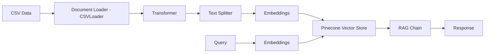

# Medical Data RAG System


A Retrieval-Augmented Generation (RAG) system for medical data (patient data) using LangChain, Pinecone, and Azure OpenAI.

## Table of Contents
- [Technology Stack](#technology-stack)
- [Prerequisites](#prerequisites)
- [Installation](#installation)
- [Environment Setup](#environment-setup)
- [Usage](#usage)
- [Package Details](#package-details)
- [Architecture](#architecture)

## Technology Stack

- **Python**: Core programming language
- **LangChain**: Framework for building LLM applications
- **Pinecone**: Vector database for storing embeddings
- **Azure OpenAI**: LLM and embeddings provider

## Prerequisites

- Python 3.9 or higher
- Azure OpenAI account with API access
- Pinecone account with API key
- Git (for cloning the repository)

## Installation

1. Clone the repository:
```bash
git clone https://github.com/kambojananya/rag_using_medical_csv_data
cd rag_using_medical_csv_data
```

2. Create and activate virtual environment:
```bash
# Windows
python -m venv venv
.\venv\Scripts\activate

# Unix/MacOS
python3 -m venv venv
source venv/bin/activate
```

3. Install dependencies:
```bash
pip install -r requirements.txt
```

## Environment Setup

1. Create a `.env` file with the following variables:
```env
AZURE_ENDPOINT=your_azure_endpoint
AZURE_OPENAI_API_KEY=your_azure_api_key
AZURE_EMBEDDINGS_ENDPOINT=your_embeddings_endpoint
AZURE_EMBEDDINGS_API_KEY=your_embeddings_api_key
PINECONE_API_KEY=your_pinecone_api_key
PINECONE_INDEX_NAME=your_index_name
PINECONE_CLOUD=aws
PINECONE_REGION=us-east-1
```

## Usage

1. Prepare your medical data CSV file
2. Run the main script:
```bash
python main.py
```

## Medical Data CSV Explanation

This document explains the structure and content of the `medical_data.csv` file, which contains medical records for 25 patients. The data includes various fields such as patient ID, name, age, gender, diagnosis, treatment, notes, BP (blood pressure) readings, and glucose readings.

### CSV Structure

The CSV file has the following columns:

- `patient_id`: A unique identifier for each patient.
- `name`: The name of the patient.
- `age`: The age of the patient.
- `gender`: The gender of the patient (M for male, F for female).
- `diagnosis`: The medical diagnosis for the patient.
- `treatment`: The prescribed treatment for the diagnosis.
- `notes`: Additional notes regarding the patient's condition or treatment.
- `bp_reading`: The blood pressure reading of the patient (in the format systolic/diastolic).
- `glucose_reading`: The glucose reading of the patient (in mg/dL).

### Sample Data

Here is a sample of the data in the CSV file:

```csv
patient_id,name,age,gender,diagnosis,treatment,notes,bp_reading,glucose_reading
1,John Doe,45,M,Hypertension,Medication,Regular check-ups needed,140/90,110
2,Jane Smith,30,F,Diabetes,Insulin therapy,Monitor blood sugar levels,120/80,180
3,Michael Brown,50,M,Asthma,Inhaler,Use inhaler as needed,130/85,95
4,Emily Davis,25,F,Anemia,Iron supplements,Increase iron intake,110/70,100
5,David Wilson,60,M,Arthritis,Physical therapy,Exercise regularly,135/88,105
```

## Package Details

### Core Dependencies

- **langchain** (v0.1.0+)
  - Purpose: Orchestrates the RAG pipeline
  - Key components: Document loaders, text splitters, embeddings integration

- **pinecone-client** (latest)
  - Purpose: Vector database operations
  - Features: Serverless deployment, vector storage, similarity search

- **openai** (latest)
  - Purpose: Interface with Azure OpenAI
  - Used for: Text embeddings, LLM queries

- **python-dotenv** (latest)
  - Purpose: Environment variable management
  - Loads configuration from .env file

### Optional Dependencies

- **pandas** (latest)
  - Purpose: Data manipulation
  - Used for: CSV processing, data transformation

## Architecture



### Data Flow

1. **Data Ingestion**: CSV loader processes product inventory
2. **Transformation**: Document transformer cleanses and enriches data
3. **Chunking**: Text splitter creates optimal chunks
4. **Vectorization**: Azure OpenAI creates embeddings
5. **Storage**: Vectors stored in Pinecone
6. **Retrieval**: Similar vectors retrieved for queries
7. **Generation**: LLM generates responses using retrieved context

## Development

### Modifying Transformers

Edit the transformer functions in `main.py`:
- `clean_text()`
- `enrich_content()`
- `format_numerical_data()`

## License

MIT

## Contributing

1. Fork the repository
2. Create your feature branch
3. Submit pull request

## Support

For issues and questions, please open a GitHub issue.
